  

  

  

## 🎯 À Propos de Moi

- 🔬 **Spécialiste en IA médicale** avec expertise en diagnostic automatisé
- 📊 **Data Scientist** passionné par l'analyse prédictive avancée
- 🏥 **Mission** : Révolutionner les diagnostics médicaux par l'IA
- 🌍 **Localisation** : Côte d'Ivoire 🇨🇮
- 🎓 **Formation** : Expert en Machine Learning & Intelligence Artificielle
- 💡 **Passion** : Transformer les données en solutions qui sauvent des vies
- 📧 **Contact** : cyrilledady0501@gmail.com
- 📱 **Téléphone** : +225 0709774501

 

  

## 🛠️ Arsenal Technologique

### 💻 Langages de Programmation

### 🤖 Intelligence Artificielle & Machine Learning

### 📊 Analyse & Visualisation de Données

### 🌐 Développement Web & Cloud

  

## 🏆 Projet Phare : Système de Diagnostic Cardiaque par IA

  

  

### 🎯 Caractéristiques Révolutionnaires

<table align="center">
<tr>
<td width="50%">

#### 🤖 **Intelligence Artificielle Médicale**
- Modèles ML de pointe (CatBoost, XGBoost, Gradient Boosting)
- Algorithmes d'ensemble optimisés pour la précision médicale
- Validation croisée rigoureuse avec métriques cliniques

#### 📊 **Performance Exceptionnelle**
- **>95%** de précision sur les diagnostics cardiaques
- Sensibilité et spécificité optimisées pour usage clinique
- Temps de réponse < 2 secondes

</td>
<td width="50%">

#### 🏥 **Interface Médicale Professionnelle**
- Application Streamlit intuitive pour médecins
- Rapports cliniques automatisés
- Visualisations médicales interactives

#### 🔒 **Sécurité & Conformité**
- Conformité RGPD et standards médicaux
- Chiffrement des données patients
- Audit trail complet

</td>
</tr>
</table>

  

## 📊 Statistiques GitHub

  

  
  

  

  

  

## 🎯 Domaines d'Excellence

| 🏥 **IA Médicale** | 📊 **Machine Learning** | 🔍 **Data Mining** |
|:---:|:---:|:---:|
| Diagnostic automatisé | Classification avancée | Pattern recognition |
| Imagerie médicale | Régression prédictive | Clustering intelligent |
| Biomarqueurs | Ensemble methods | Feature engineering |

| 📈 **Analyse Prédictive** | 🌐 **MLOps** | 📋 **Recherche Clinique** |
|:---:|:---:|:---:|
| Modèles de risque | CI/CD pour ML | Études statistiques |
| Prédiction de santé | Monitoring modèles | Analyse de cohortes |
| Alertes précoces | Déploiement cloud | Validation clinique |

  

## 🌟 Projets Innovants en Cours

```mermaid
graph LR
    A[🔬 Détection Diabète] --> B[Biomarqueurs]
    C[🧠 Prédiction AVC] --> D[Imagerie IA]
    E[📱 App Mobile] --> F[Suivi Patients]
    G[🤝 Plateforme Collaborative] --> H[Professionnels Santé]
    
    style A fill:#ff6b6b
    style C fill:#4ecdc4
    style E fill:#45b7d1
    style G fill:#96ceb4
```

- 🔬 **Système de détection précoce du diabète** avec analyse de biomarqueurs avancée
- 🧠 **Modèle de prédiction des AVC** basé sur l'imagerie médicale et deep learning
- 📱 **Application mobile intelligente** pour le suivi en temps réel des patients cardiaques
- 🤝 **Plateforme collaborative** pour les professionnels de santé avec IA intégrée

  

## 📫 Connectons-nous !

  

  

## 💡 Citation Inspirante

  

  

## 🎵 Actuellement en train d'écouter

  

  

  

  
**⭐ Merci de visiter mon profil ! N'hésitez pas à explorer mes projets et à me contacter pour des collaborations passionnantes ! ⭐**

